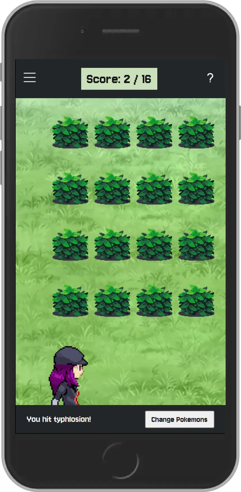

# PokeHit

## [Play Game](https://pokehit.netlify.app/)

## Overview

A game that challenges a user's memory by hitting on each Pokemon only once. The program is designed to demonstrate React's useEffect hook, Fetch api, and async/await.

# Installation 

1. Clone this repository: **git clone git@github.com:corvusjj/PokeHit.git**
2. Navigate into the project directory: **cd PokeHit**
3. Install dependencies: **npm install**
4. Start dev server: **npm run dev**

## Technologies Used

- React
- Typescript
- Sass
